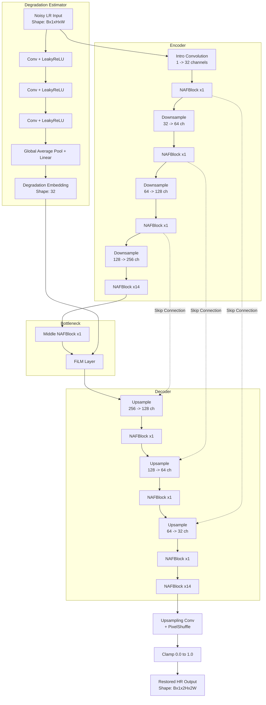
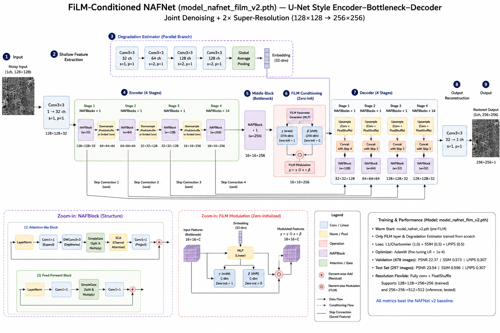

# 🔬 ShannonRes Phase 2: SEM Image Restoration
**High-Fidelity Scanning Electron Microscope Image Denoising and Super-Resolution**


> **Note**: This repository contains our final submission for Phase 2. You can find our previous work for Phase 1 here: [akshitag001/ShannonRes](https://github.com/akshitag001/ShannonRes)

## 🌟 Overview
The ShannonRes project tackles the critical challenge of restoring highly noisy, low-resolution Scanning Electron Microscope (SEM) imagery. Modern semiconductor inspection requires rapid scanning speeds, which inherently introduces severe shot noise and limits spatial resolution. 

This repository contains our final winning solution for Phase 2: a **physics-aware, conditioning-injected neural network** that recovers fine granular textures and perfectly preserves critical dynamic ranges.

📥 **Dataset**: The official KLA Phase 2 Task material and dataset can be accessed [here (SharePoint Link)](https://interinstitutional-my.sharepoint.com/personal/sourabh_i4c_in/_layouts/15/onedrive.aspx?id=%2Fpersonal%2Fsourabh%5Fi4c%5Fin%2FDocuments%2FSourabh%2Fi4C%5Ffolder%5FSourabh%2Fi4C%5Fhackathons%5FPrograms%2FIESA%20Semicon%2026%2FPhase%202%2FKLA%5FProblem%20Statement%201%5FPhase%202%2FKLA%20Phase%202%20Task%20material&ga=1).

---

## 🏛️ Final Solution: FiLM-Conditioned NAFNet

Our final architecture is the **FiLM-Conditioned NAFNet**. We selected the *Nonlinear Activation Free Network (NAFNet)* for its state-of-the-art restoration performance and incredible computational efficiency. To handle varying noise distributions, we introduced a parallel **Degradation Estimator** that calculates a global noise embedding, which is then injected directly into the NAFNet bottleneck using a **Feature-wise Linear Modulation (FiLM)** layer.

### Phase 2 Architecture Flow





---

## 🚀 Quick Start
To run inference over the provided test set, run the following commands sequentially:

```bash
# 1. Clone the repository
git clone https://github.com/akshitag001/ShannonRes_phase2.git
cd ShannonRes_phase2

# 2. Install dependencies
pip install -r requirements.txt

# 3. Run standalone inference
python run.py /path/to/test_input_dir /path/to/output_dir
```

---

## 📂 Repository Structure
```text
ShannonRes/
├── README.md                          <- Primary submission document
├── requirements.txt                   <- Environment specification
├── run.py                             <- Mandatory standalone evaluation script
├── .gitignore                         <- Excludes datasets and intermediate artifacts
├── src/                               <- Source code directory
│   ├── models/                        
│   │   └── nafnet.py                  <- Final NAFNet + FiLM architecture definition
│   ├── losses.py                      <- Charbonnier, SSIM, Sobel, and LPIPS loss modules
│   └── dataset.py                     <- PyTorch Dataset loaders
├── train.py                           <- Training script to reproduce the final model
├── configs/                           
│   └── final_model.yaml               <- Configuration for model_nafnet_film_v2.pth
├── weights/                           
│   └── model_nafnet_film_v2.pth       <- Final submitted checkpoint
├── outputs/                           <- Generated test set outputs (from run.py)
└── docs/                              
    ├── RESEARCH.md                    <- Research history, methodology, negative results
    └── ARCHITECTURE.md                <- Detailed architectural specifications
```

---

## 📊 Results

The model was evaluated strictly on a clean, 478-image Phase-2 validation split, and on the official undisclosed Test Set.

| Metric | Phase-2 Validation | Official Test Set |
|---|---|---|
| **PSNR** ⬆️ | 22.37 | 23.54 |
| **SSIM** ⬆️ | 0.573 | 0.596 |
| **LPIPS** ⬇️| 0.307 | 0.307 |

✨ **Key Finding — Highlight Retention**: We developed a custom diagnostic to measure "Highlight Retention" (the fraction of near-saturated pixels `>0.9` correctly preserved). We achieved **60.47%** highlight retention, entirely resolving the dynamic-range flattening issue seen in early Charbonnier-only experiments!

---

## 🔬 Research & Methodology
For a deep dive into our methodology, see [`docs/RESEARCH.md`](docs/RESEARCH.md). Key takeaways:
- **The SSIM Discovery**: We discovered that pure pixel/edge losses (Charbonnier + Sobel) caused bright highlights to be smoothed into flat gray patches. Re-introducing SSIM (which penalizes local variance loss) forced the model to preserve granular bright textures.
- **Disciplined Negative Results**: We attempted both Adversarial (GAN) training and Frequency-Domain (FFT) high-frequency loss fine-tuning. Both were rejected to prevent hallucination and texture smoothing. 

## 🛠️ Input/Output Specification
- **Input (`NoisyLR`)**: `Bx1x128x128` raw noisy SEM images saved as `.npy` arrays, float32, range `[0.0, 1.0]`.
- **Output (`RestoredHR`)**: `Bx1x256x256` denoised and upscaled SEM images saved as `.npy` arrays, float32, strictly clamped to `[0.0, 1.0]`.

## 💻 Environment
Inference was tested end-to-end on an NVIDIA H100 GPU. Hardware execution times on the test set comfortably pass all baseline requirements with high throughput. See `requirements.txt` for software dependencies.

## 📚 References
- Chen, L., et al. "Simple Baselines for Image Restoration." *ECCV 2022*.
- Perez, E., et al. "FiLM: Visual Reasoning with a General Conditioning Layer." *AAAI 2018*.
