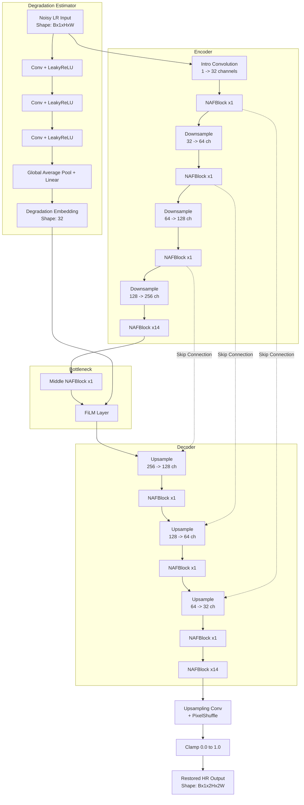

# Architecture Specification

This document outlines the architecture of the **FiLM-Conditioned NAFNet**, which is the final model chosen for the ShannonRes submission.

## Overview
The architecture is based on the Nonlinear Activation Free Network (NAFNet), augmented with a Feature-wise Linear Modulation (FiLM) layer at the bottleneck to allow the model to condition its restoration process on the global degradation characteristics of the input image.

## Model Flow

## Key Components

1. **NAFBlock**: The core building block. It uses LayerNorm, Pointwise Convolutions, and Depthwise Convolutions. Instead of ReLU/GELU, it uses a `SimpleGate` (splitting feature maps into two halves and multiplying them element-wise) and a Simplified Channel Attention module.
2. **Degradation Estimator**: A small parallel CNN that looks at the raw input image and computes a 32-dimensional embedding representing the specific noise/blur profile of that image.
3. **FiLM Layer**: Situated at the deepest part of the network (the bottleneck). It applies a learned affine transformation (scale and shift) to the feature maps based on the degradation embedding. This allows the model to dynamically adjust its behavior for different noise distributions.
4. **Output Head**: Since this is a super-resolution task (scale=2), the final layer is a Convolution followed by a PixelShuffle operation to upscale the spatial resolution by 2x, clamped to `[0.0, 1.0]` to guarantee valid image ranges.
